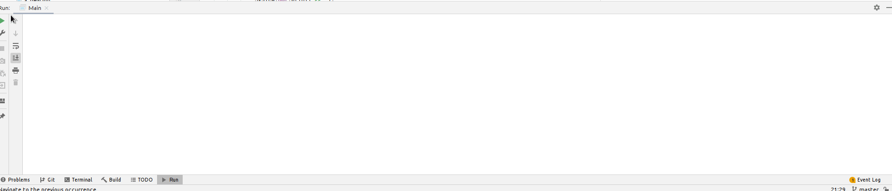
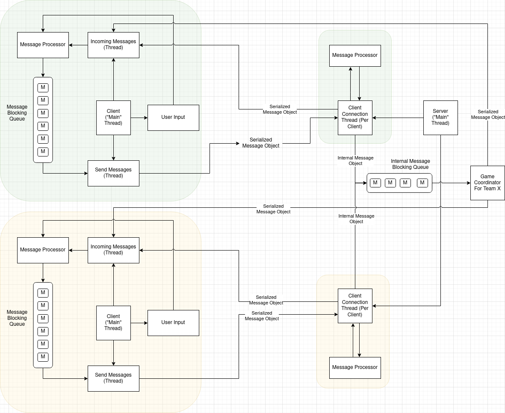

# TYPING RELAY RACE

This is the official repository of the **Typing Relay Race** game from **Group 1**, Distributed Systems, **Project 1**, WS20/21. :)

**Table of Contents**

- [How to test the game](#How-to-test-the-game)
- [Known Bugs](#Known-bugs)
- [Architecture](#Architecture)
    - [Diagram](#Diagram)
- [Messaging Protocol](#Messaging-Protocol)
    - [Status Codes](#Status-Codes)
    - [Messages](#Messages)
        - [Payloads](#Payloads)
    - [Example Messages](#EXAMPLE-MESSAGE)

## How to test the game

The whole system is fairly easy to understand. Clients communicate with the server through pre-defined commands that take input, depending of what is being requested.



Every command starts with a `:`, for example `:help`. The full list of supported commands is:

```
COMMAND                                             ACTION
===========================================================================
:help Show Help                                     Show help
:register <username> <password> <repeat_password>   Register an account
:login <username> <password>                        Login
:scoreboard                                         View Scoreboard
:create <team_name> <public | private>              Create a New Public/Private Team
:join <team_name> <password (only if private team)> Join an Existing Team
:teams                                              List All Teams
:ping                                               Connection Healthcheck
===========================================================================
```

To run the game, you have to have the server running first. To run the server, go to the `Server.java` class, and run it's `main` method. To confirm the server is running, you should be able to see the log:

```
Server is running...
```

At this point you leave the server to do it's job and you switch to the clients.

If you are running this in `Intelij Idea`, make sure you have allowed running in parallel, so you can be able to spawn more than one client. This is done by opening the `Client.java` file in the `client` package, and opening `Run -> Edit Configurations`. You should tick the checkbox for `Allow running in parallel`, if you don't have that, you should click on `Modify options` and click on `Allow multiple instances`.

Now you are ready to spawn 2 or more clients.

When you spawn a client, you are greeted with the famous `>>`, which tells you that you can now write commands and send requests to the server.

A basic gameplay would be:

### Client 1

```
>> :register john mypassword mypassword
[SERVER: OK (100)] Registered successfully.

>> :login john mypassword
[SERVER: OK (100)] SESSION TOKEN: Yj5b5KpI4bhzIYUzhD9e7uNLZ-tmKbFz

>> :teams
[SERVER: Info (110)] There are no teams created. You can be the first. :)

>> :create wolfs public
[SERVER: OK (100)] Team WOLFS created successfully. Members 1/2. Open to all!

>> :teams
[SERVER: OK (100)] 
Team Name           Created By          Requires Password   Players             
===================================================================
wolfs               john                No                  1/2

>> :scoreboard
[SERVER: Info (110)] Scoreboard empty! No one has played, yet.
```

At this point, `Client 1` needs to wait for another player to join their team.

### Client 2

```
>> :register john mypassword mypassword
[SERVER: OK (100)] Registered successfully.

>> :login john mypassword
[SERVER: OK (100)] SESSION TOKEN: Yj5b5KpI4bhzIYUzhD9e7uNLZ-tmKbFz

>> :teams
[SERVER: OK (100)] 
Team Name           Created By          Requires Password   Players             
===================================================================
wolfs               tin                 No                  1/2                 
>> :join wolfs
```

Now the game begins! Both of the clients have to send `:ready` before the countdown starts. First the `owner` of the team has to say they are ready, after that the player who just joined.

After they both say they are ready, the server starts a countdown of 5 seconds. When the countdown finishes, the `owner` is being provided by random words that sum up to 80 characters. The player needs to send the text back (without any commands, or `:`) to the server, like it was provided to them. The server in the meantime is counting the time it takes the player to write and submit the text.

After the first player submits the text, the second player does exactly the same thing, but is provided different text.

When they both submit the text, the server returns the total time for the team, logs it into the scoreboard and removes the team. If the players want to play again, the whole process of team creating needs to be done again.

**NOTE**: The scoreboard only lists the **TOP 5** teams! If your team score is worse than the 5th team, your team score will not be logged. There is no place for bad performers. :)

If your team does worse than the 4th team, but better than the 5th, the 5th team is kicked out of the list, and your team takes its spot.


## Known bugs

While the game works as it should, there are still few bugs that need to be solved.

1. **Socket stream header gets replaced by another header** - this problem happens **rarely**, thus why it is __hard__ to debug. You have to be really unlucky to stumble across this problem, and it seems that it only happens when joining a `private` team, i.e. `:join wolfs PASSWORD`. A work-around until it is fixed is to simply re-run the server, and both of the clients. When joining a `public` team this problem does not occurs.

## Architecture

**Clients**

The architecture for this game is pretty simple. Each client starts 2 threads, one for sending messages and the other for handling incoming messages. After starting these threads, the main program enters a loop that reads the user input.

The user input, and the incomming messages are passed to a message processor that packs requests for the server and passes the messages to a blocking queue, where on the other end the other thread, the one for sending messages is waiting for them. As soon as a message is available in the queue, the thread responsible for sending messages sends the message over the wire to the server.

**Server**

When the server starts, it listens for an incoming connection. As soon as there is a connection, it spawns a thread to handle the communication, and it returns to listening.

Each spawned thread creates a **Message Processor** object that processes incoming messages.

When a message is received from the client, the server passes the message to the **Message Processor**. However, before the message is passed to the **Message Processor**, the server checks if the client is **IN GAME**, if it is, the message is being passed to a **Game Coordinator** instead.

**Game Coordinators**

Game coordinators are spawned when a second player joins a team. Game coordinators are coordinating the game for both players, while also directly contacting them through the socket.

The team is removed and the coordinator is destroyed after both players submitted a text correctly.

**Threads**

For each client, a thread is being spawned from the server. For each team, a game coordinator is spawned, also from the server. The formula that yields the total number of threads is:

```
T = C + I
```

Where,

- **T** - total number of threads
- **C** - total number of connected clients
- **I** - total number of teams that are in-game

For example, if there are 10 clients connected, and 4 of them formed 2 teams and are in-game (1 team per 2 clients), then,

```
T = 10 + 2 = 12
```

**Security**

Since this program is using in-memory data structures as database, it does not take care of security that much. In that matter, passwords are stored as `SHA-1` hashes, with appended `salt`. Stronger algorithms exist, but it is good enough for a small program like this. 

**Logging in**

When a user is logged in, the server issues a `session token` which lasts until the user explicitly sends a `:logout` command.

Logged in users send their session token as part of their message objects, which are then checked by the server if they are valid, and if they are, they are allowed to ask for resource or execute a command from the server.

### Diagram


## Finding your way around

The structure of the codebase is divided in three packages. 

1. The `client` package that hosts all logic related to a client.
2. The `server` package that hosts all logic related to a server.
3. The `shared` package that hosts code that is shared between the two packages mentioned above.

To start studying the code, for the client, you start at the `Client.java` file in the `client` package.

To start studying the code, for the server, you start at the `Server.java` file, in the `server` package.

It is important to note that most of the functions that execute something that was asked from the client are in the `Store.java` file, in the `server` package. Those functions are usually called from the `MessageProcessor.java` file, which checks incomming messages for what payload they are bringing, and then passing that message to a function that knows how to take care of that.

## Messaging Protocol

### Status Codes

Status codes that are returned by the server.

```
CODE    MESSAGE               
====    =====================
100     OK                    
110     Info                  

200     Bad Request          
210     Internal Server Error
220     Forbidden            
230     Conflict    
240     Not Found         
```

### Messages

The main communication between the server is done by sending serialized messages over the wire. An example message would look like:

```
{
    isResponse<boolean>: false,
    isError<boolean>: false,
    reply<null | int>
    payload<<payload_name>Payload>: {
        ...
    }
}
```

#### Payloads

Payloads are sent within a message, and its a way of transfering data that needs to be processed. An example payload would look like:

**InfoPayload (Server Providing Information)**

Sent by: **Server**


```
{
    message<String>: "pong!"
}
```

**RegisterPayload**

Sent by: **Client**

```
{
    username<String>: "john",
    password<String>: "doe",
    repeat_password<String>: "doe"
}
```

When the server or the client receives any kind of payload, it is checking if the payload is an instance of the already known payloads. A logic is executed depending on the payload type.


### EXAMPLE MESSAGE

``` 
// Client
{
    isResponse: false,
    reply: null,
    payload: {                  # <- payload is instanceof LoginPayload
        username: "tin",
        password: "QWERTY1234",
    }
    isError: false,
}

// Server

{
    isResponse: true,
    reply: 100,         # 100 - OK
    payload: {
        sessionToken: <session_token>
    },
    isError: false,
}

.
.
.

// Client
{
    isResponse: false,
    reply: null,
    payload: {},        # payload is not null, but instanceof ScoreboardPayload
    isError: false,
}

// Server
{
    isResponse: true,
    reply: 110,          # 110 - Info
    payload: {
        scoreboard: { ... }
    },
    isError: false,
}
```
